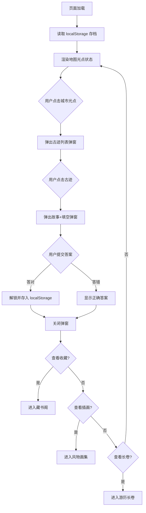

# 国风文人游历 · 产品需求文档（PRD）

## 1. 产品背景

### 1.1 设计初衷

传统文史内容的展示方式多以静态文字为主，用户被动阅读，缺乏探索和互动体验。诗词作为中华文化的瑰宝，往往被束之高阁，难以让现代用户产生共鸣和深刻记忆。

本项目希望通过**游戏化探索机制**，将苏轼、李清照两位宋代文人的人生足迹转化为可交互的游历地图，让用户在探索中主动了解文人故事、参与诗词互动，实现"寓教于乐"的文化传播。

### 1.2 核心问题

- **被动阅读**：传统文史内容单向输出，用户参与感低，学习动力不足
- **记忆困难**：诗词背诵缺乏情境支撑，难以形成深刻记忆
- **碎片化**：文人故事与创作背景割裂，无法建立完整认知
- **无成就感**：学习过程缺乏反馈机制，难以坚持和获得满足感

### 1.3 期望体验

用户打开页面，仿佛穿越回宋代，跟随苏轼、李清照游历四城。通过地图探索发现古迹、阅读故事理解背景、完成答题解锁内容、收集诗词积累成就，最终生成属于自己的"游历长卷"——这个过程既是学习，也是创作，更是对传统文化的深度体验。

### 1.4 设计思考

在设计初期，我们考虑过多种呈现方式：纯文字阅读、图片画廊、视频讲解等。最终选择游戏化探索模式，核心考量在于：

1. **主动学习优于被动接受**：通过答题解锁机制，让用户主动回忆诗词内容，形成深度记忆
2. **情境化学习**：每首诗词都绑定具体的创作地点和故事背景，帮助理解诗词意境
3. **收集成就驱动**：类似集邮的收集心理，激发用户探索全部内容的动力
4. **文化体验**：水墨国风视觉风格，营造沉浸式宋代文人氛围

---

## 2. 产品定位

### 2.1 产品类型

**国风轻交互文史探索网页应用**

### 2.2 核心体验流程

```
探索历史城市
    ↓
发现文人故事
    ↓
参与诗词互动
    ↓
收集文化内容
    ↓
生成个人游历记录
```

### 2.3 目标用户

- 喜爱传统文化、古典诗词的普通用户
- 希望以轻松方式学习文史知识的学生群体
- 寻求文化体验的休闲用户

### 2.4 产品价值

- **零门槛**：浏览器打开即玩，无安装、无注册
- **沉浸式**：水墨国风视觉，营造宋代文人氛围
- **游戏化**：收集反馈机制，激发探索欲望
- **可留存**：生成个人游历长卷，记录探索成果

### 2.5 工程化思考

项目采用纯前端技术栈（HTML/CSS/JavaScript），无后端依赖，核心考量：

1. **部署便捷**：只需静态文件托管，无需服务器配置
2. **数据安全**：所有数据保存在用户本地浏览器（localStorage），无隐私泄露风险
3. **跨平台兼容**：支持桌面和移动设备，无需适配多端
4. **离线可用**：下载页面后可离线运行，数据本地存储

---

## 3. 用户体验流程

### 3.1 完整用户流程

```
首页水墨地图
    ↓
选择城市（济南/黄州/杭州/金华）
    ↓
点击古迹节点（3处/城）
    ↓
查看文史内容和诗词原文
    ↓
完成诗词填空答题
    ↓
答对 → 保存解锁状态（localStorage）
    ↓
进入藏书阁查看收藏的诗词
    ↓
进入风物画集查看已解锁插画
    ↓
查看游历长卷（Canvas生成，可下载PNG）
```

### 3.2 流程图



### 3.3 交互细节

#### 3.3.1 地图交互
- **城市光点**：四城光点按地理位置分布，未解锁显示灰色，已解锁显示墨色并带水墨扩散动画
- **点击反馈**：点击光点弹出城市古迹列表，显示"共3处古迹，已收录X处"进度
- **键盘支持**：支持 Tab 键聚焦、Enter/Space 键触发

#### 3.3.2 答题交互
- **填空题干**：诗句中关键词用下划线替代，用户输入答案提交
- **答案判分**：支持宽松比对（去除空格、标点差异），增强用户体验
- **即时反馈**：答对显示绿色成功提示，答错显示红色错误提示并展示正确答案

#### 3.3.3 成就系统
- **城市达成**：集齐某城3处古迹后，弹出专属祝贺弹窗，解锁古风边框和城市全景图
- **全局通关**：四城全部解锁后，解锁全套印章系统，可用于长卷装饰

---

## 4. 核心功能模块

### 4.1 水墨地图探索模块

**实现方式**：通过 `renderMap()` 函数动态生成城市光点，绑定点击事件触发古迹列表弹窗。

- **城市节点展示**：首页展示宋代风格水墨地图，四城光点按地理位置百分比坐标分布（济南22%/24%、黄州32%/70%、杭州70%/26%、金华74%/70%），未解锁城市显示灰色，已解锁城市显示墨色并带水墨扩散动画效果
- **古迹光点交互**：点击城市光点弹出该城古迹列表，显示"共3处古迹，已收录X处"进度；点击古迹进入答题页面
- **文人游历路线设计**：苏轼（黄州、杭州）、李清照（济南、金华）两条独立游历主线，视觉风格差异化呈现（苏轼-墨绿，李清照-朱砂）

### 4.2 古迹内容模块

**数据结构**：`CITIES` 数组包含4个城市对象，每个城市包含3个古迹对象，共12处古迹。

- **城市**：四座历史文化名城（济南、黄州、杭州、金华）
- **古迹**：每城三处代表性古迹：
  - 济南：漱玉泉、大明湖、趵突泉
  - 黄州：东坡赤壁、定慧院、雪堂
  - 杭州：西湖、望湖楼、孤山
  - 金华：八咏楼、双溪、金华寓所
- **文史故事**：每处古迹配有文人创作背景故事，帮助用户理解诗词创作情境
- **诗词内容**：每处古迹对应一首经典诗词，完整展示原文（支持换行保留格式）

### 4.3 诗词答题模块

**核心函数**：`checkAnswer()` 实现答案判分和解锁逻辑。

- **填空答题**：每处古迹对应一道诗词填空题，题干中关键词用下划线替代（`____`），用户输入答案提交
- **答案判分**：采用宽松比对算法（`normalize()`），去除空格和中英文标点后比对，增强用户体验
- **答题结果反馈**：答对显示绿色成功提示，答错显示红色错误提示并展示正确答案
- **解锁机制**：答对后自动解锁该古迹，调用 `unlockSite()` 同步保存到 localStorage
- **成就检测**：解锁后检测城市达成和全局通关状态，触发对应祝贺弹窗

### 4.4 藏书阁模块

**核心函数**：`renderLibrary()` 渲染藏书阁页面，`refreshLibraryBadges()` 更新达成状态。

- **已解锁内容分类展示**：按城市分栏展示已解锁的诗词卡片，四列布局，每列显示城市名称、收集进度（X/3）、古迹卡片
- **收藏反馈**：已解锁显示完整诗词（标题+作者+全文），未解锁显示灰色占位（"待解锁 · 古迹名"）
- **城市达成效果**：城市3处古迹全部解锁后，显示专属水墨边框（根据城市主题）和"✦ 达成"徽章

### 4.5 今日诗签模块

**核心函数**：`pickVerse()` 随机抽取诗句，`renderSidebarVerse()` 和 `renderDrawVerse()` 分别渲染侧边栏和抽签页。

- **功能描述**：首页侧边栏随机展示一句经典诗句，诗文抽签页面提供更大尺寸展示
- **诗句池**：包含13句苏轼和李清照的经典诗句（VERSE_POOL）
- **交互**：点击"抽取诗文"按钮随机切换诗句
- **视觉**：卷轴样式卡片，营造古风氛围

### 4.6 风物画集模块

**核心函数**：`renderGallery()` 渲染画集页面，`openGalleryPreview()` 打开大图预览。

- **功能描述**：展示已解锁的古迹插画和城市全景图
- **数据绑定**：`GALLERY_IMAGES` 对象存储每城的插画数据，包含 sites（古迹插画）和 panorama（城市全景）
- **布局**：按城市分栏，每城3处古迹+1张全景（城市全解锁后显示）
- **插画展示**：已绑定图片资源的古迹显示真实插画，未绑定的使用Canvas绘制水墨风格抽象图形占位
- **交互**：点击插画查看大图预览，支持下载图片

### 4.7 游历长卷模块

**核心函数**：`renderScrollCanvas()` 绘制长卷，`drawSiteIllustration()` 绘制古迹插画。

- **功能描述**：将已解锁内容汇集成一幅横向国风长卷
- **Canvas生成**：纯Canvas绘制，包含标题区域、城市分卷、古迹内容（插画+名称+诗词+故事摘要）、印章、卷尾落款
- **高清适配**：使用 `devicePixelRatio` 确保高清显示
- **图片加载**：采用"缓存+重绘"策略，图片异步加载完成后自动重绘长卷
- **交互**：选择边框样式（城市专属边框需城市达成解锁）、添加印章（全局通关解锁）、拖动印章位置、下载PNG长图

---

## 5. 交互设计理念

### 5.1 游戏化探索

**设计思考**：借鉴游戏化设计原则，将学习过程转化为探索旅程。

- **渐进解锁**：从城市到古迹，层层递进，逐步揭示内容。用户需要先解锁城市中的一处古迹，才能看到其他古迹的完整信息
- **即时反馈**：答题后立即显示结果，答对时有绿色动画效果，答错时显示正确答案。这种即时反馈机制增强用户的参与感和学习动力
- **收集成就**：城市达成显示专属边框和"✦ 达成"徽章，全局通关解锁印章系统，提供明确的成就目标和满足感

### 5.2 收集和解锁反馈

**设计思考**：通过视觉变化反馈用户的探索进度，形成正向激励循环。

- **进度可视化**：每城顶部显示"X/3"收集进度，直观展示探索成果。用户可以清晰看到自己的探索进度
- **视觉升级**：从灰色占位到完整诗词卡片，从普通边框到专属水墨边框。每次解锁都带来视觉上的变化和提升
- **成果展示**：游历长卷作为最终成果，可下载保存，形成个人文化记录。用户可以将自己的探索成果分享或收藏

### 5.3 国风视觉体验

**设计思考**：整体视觉风格统一为宋代水墨风格，营造沉浸式文化体验。

- **色彩体系**：宣纸米色（#f5f0e6）作为底色，墨色（#6b5538）作为主色，朱砂红（#9c3b2e）作为点缀色
- **纹理效果**：通过SVG滤镜和CSS实现宣纸噪点、水墨晕染、淡墨山水轮廓等效果
- **装饰元素**：卷轴装饰、印章元素、书法风格文字，增强古风氛围
- **文人差异化**：苏轼系城市使用墨绿色调，李清照系城市使用朱砂红色调，形成视觉区分

### 5.4 文史内容与互动结合

**设计思考**：将被动阅读转化为主动参与，通过互动加深对文史内容的理解和记忆。

- **情境化学习**：每首诗词配有创作背景故事，帮助用户理解诗词创作的历史背景和情感内涵
- **主动回忆**：填空题形式要求用户主动回忆诗词内容，比被动阅读更有效。同时支持宽松比对，降低答题难度
- **文化体验**：水墨视觉风格营造宋代文人氛围，增强沉浸感。用户不仅是在学习，更是在体验文化

### 5.5 无障碍设计

**设计思考**：确保产品对所有用户都可访问。

- **键盘支持**：所有交互元素支持Tab键聚焦和Enter/Space键触发
- **ARIA标签**：城市光点和古迹列表项添加ARIA标签，提升屏幕阅读器兼容性
- **语义化HTML**：使用语义化标签（header、nav、main、section、footer）构建页面结构

---

## 6. 后续扩展方向

### 6.1 内容扩展

- **增加更多历史城市**：如眉山（苏轼故乡）、开封（北宋都城）、绍兴（陆游故乡）等
- **扩展更多文人主题**：如辛弃疾、陆游、欧阳修等宋代文人
- **增加更多诗词内容**：丰富每处古迹的诗词数量，增加多种答题形式（选择题、判断题等）

### 6.2 功能扩展

- **社交分享功能**：支持长卷图片分享到社交媒体
- **音频朗读功能**：添加诗词朗读，增强听觉体验
- **学习进度统计**：展示学习时长、答题正确率等数据

### 6.3 视觉扩展

- **增加更多城市专属边框和印章**：为每个新增城市设计独特的边框样式和印章
- **优化移动端适配**：针对不同屏幕尺寸优化布局和交互
- **增加动画效果**：添加页面切换动画、解锁动画等过渡效果

---

## 7. 文人与城市对应关系

| 文人 | 所属城市 | 风格基调 |
|------|----------|----------|
| **苏轼** | 黄州、杭州 | 旷达豪迈，山水江月，水墨苍劲 |
| **李清照** | 济南、金华 | 婉约清雅，花雨溪亭，工笔细腻 |

### 7.1 收集解锁机制

- **单城达成**：某城市3处古迹全部解锁后，显示专属水墨边框和"印"字印章
- **全局达成**：四城全部解锁后，解锁全套印章系统

---

## 8. 视觉设计规范

### 8.1 色彩体系

| 用途 | 颜色值 | 说明 |
|------|--------|------|
| 底色 | #f5f0e6 | 宣纸米色 |
| 主色 | #6b5538 | 墨棕色 |
| 点缀 | #9c3b2e | 朱砂红 |
| 文字 | #2b2b2b | 墨黑 |

### 8.2 字体规范

- 标题：衬线体（楷体/思源宋体）
- 正文：易读衬线体
- 诗词：楷体风格

### 8.3 边框样式

| 城市 | 边框名称 | 视觉元素 |
|------|----------|----------|
| 黄州 | 赤壁纹 | 水墨山水、赤壁江水 |
| 杭州 | 西湖柳 | 柳叶曲线 |
| 济南 | 泉纹 | 水波纹 |
| 金华 | 山影纹 | 远山轮廓 |