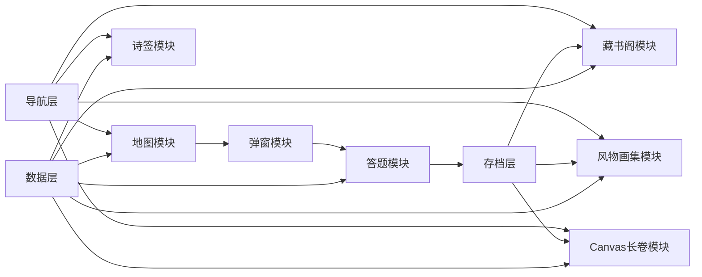
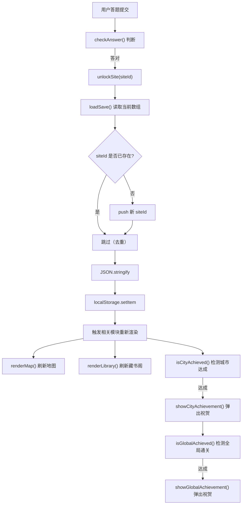

# 国风文人游历 · 技术架构文档

## 1. 技术栈

### 1.1 前端技术

| 类别 | 技术 | 版本 | 说明 |
|------|------|------|------|
| 标记语言 | HTML5 | 标准 | 语义化标签构建页面结构，包含导航、地图、弹窗、各视图容器 |
| 样式 | CSS3 | 标准 | 色彩变量、布局、动画、水墨效果，支持响应式适配 |
| 脚本 | JavaScript | ES2020 | 模块化设计，包含数据层、渲染层、交互层 |

### 1.2 数据存储

| 类别 | 技术 | 用途 |
|------|------|------|
| 本地存储 | localStorage | 存储解锁状态、长卷配置、全局通关标记 |

**实际使用的 Key：**

| Key | 类型 | 用途 |
|-----|------|------|
| `guofeng_save` | Array | 已解锁古迹 ID 数组 |
| `guofeng_scroll_config` | Object | 长卷配置（边框、印章位置、昵称） |
| `guofeng_global_achieved` | String | 全局通关标记（"1"表示已达成） |

### 1.3 渲染技术

| 类别 | 技术 | 用途 |
|------|------|------|
| 2D 渲染 | Canvas API | 游历长卷绘制、插画生成、印章渲染 |
| 高清适配 | devicePixelRatio | Canvas 高清显示，解决文字模糊问题 |
| 异步加载 | Image.onload | 图片异步加载 + 缓存 + 重绘策略 |

### 1.4 AI 工具

| 工具 | 用途 | 实际应用 |
|------|------|----------|
| Trae | 代码生成、功能迭代、Bug 修复 | 生成初始页面结构、Canvas 绘制函数、修复变量命名冲突、优化图片加载逻辑 |
| ChatGPT | 需求分析、代码审查、文档编写 | 辅助拆解需求、审查代码质量、编写技术文档 |
| AI 图像生成 | 国风地图背景、水墨风格素材 | 生成地图背景、古迹插画、长卷背景、印章图片 |

### 1.5 工程化思考

**纯前端架构选型理由：**

1. **零部署成本**：无需后端服务器，只需静态文件托管
2. **数据安全**：所有数据保存在用户本地，无隐私泄露风险
3. **离线可用**：下载页面后可离线运行
4. **跨平台兼容**：支持桌面和移动设备，无需多端开发

---

## 2. 项目目录结构

```
7.8 demo_game/
├── index.html                  # 页面骨架（导航、地图、弹窗模板、各视图容器）
├── style.css                   # 国风样式（色彩变量、布局、动画、水墨效果）
├── script.js                   # 核心逻辑（数据+渲染+交互，约1900行）
├── data.js                     # 备用数据文件（当前未使用）
├── PRD.md                      # 产品需求文档
├── TechnicalArchitecture.md    # 技术架构文档
└── assets/                     # 静态资源目录
    ├── gallery/                # 风物画集图片（按城市分类）
    │   ├── hangzhou/           # 杭州：gushan.png, wanghu.png, xihu.png
    │   ├── huangzhou/          # 黄州：chibi.png, dinghui.png, xuetang.png, panorama.png
    │   ├── jinan/              # 济南：baotu.png, daming.png, shuyu.png
    │   └── jinhua/             # 金华：bayong.png, jinhua.png, shuangxi.png
    ├── map/                    # 地图背景：map-bg.png
    ├── scroll/                 # 长卷背景：scroll-bg.png, scroll-main-bg.png
    └── stamps/                 # 印章图片：hangzhou.png, huangzhou.png, jinan.png, jinhua.png
```

### 2.1 文件职责

| 文件 | 职责 | 说明 |
|------|------|------|
| index.html | 页面结构 | 语义化标签构建，包含顶部导航、首页地图、侧边栏、5个视图容器、6个弹窗模板 |
| style.css | 样式定义 | 色彩变量、布局、动画、水墨效果、响应式适配，约3000行 |
| script.js | 核心逻辑 | 数据层、存档层、导航层、地图层、弹窗层、答题层、侧边栏诗签、藏书阁、风物画集、长卷渲染，约1900行 |
| data.js | 备用数据 | 当前未使用，预留用于内容数据与逻辑分离 |

### 2.2 数据存储设计

**当前实现**：所有业务数据内置在 `script.js` 的 `CITIES` 常量中，包括：

| 数据对象 | 用途 | 位置 |
|----------|------|------|
| `CITIES` | 城市/古迹/诗词核心数据 | 第17-186行 |
| `VERSE_POOL` | 诗句池（诗签功能） | 第189-203行 |
| `SEALS` | 印章数据（全局通关后解锁） | 第214-221行 |
| `CITY_FRAMES` | 城市专属边框配置 | 第226-231行 |
| `GALLERY_IMAGES` | 风物画集插画数据 | 第238-271行 |

**设计原则**：内容数据与页面逻辑在同一文件中，但通过常量隔离，便于后续迁移到独立的 `data.js` 文件。

### 2.3 assets 目录说明

| 子目录 | 用途 | 实际文件 |
|--------|------|----------|
| gallery | 风物画集图片，按城市分类存放古迹插画和全景图 | 杭州3张、黄州4张（含全景）、济南3张、金华3张，共13张 |
| map | 地图背景图片，用于首页水墨地图展示 | map-bg.png（水墨风格地图背景） |
| scroll | 长卷背景图片，用于游历长卷页面背景 | scroll-bg.png、scroll-main-bg.png（卷轴展开样式） |
| stamps | 印章图片，用于长卷印章装饰 | 4张城市印章（杭州、黄州、济南、金华） |

**资源引用方式**：

- **地图背景**：CSS `background-image` 通过 `.map-bg` 类引用
- **长卷背景**：CSS `background-image` 通过 `.scroll-stage` 类引用
- **古迹插画**：JavaScript 中通过 `site.img` 字段动态引用，在 Canvas 和 img 标签中展示
- **印章图片**：JavaScript 中通过 `SEALS` 数据动态生成，Canvas 绘制或 DOM 元素展示

---

## 3. 前端模块划分

### 3.1 模块清单

| 模块 | 主要函数 | 职责 | 代码位置 |
|------|----------|------|----------|
| **数据层** | `CITIES`、`VERSE_POOL`、`SEALS`、`CITY_FRAMES`、`GALLERY_IMAGES` | 城市/古迹数据、诗句池、印章、边框配置、插画数据 | 第17-271行 |
| **存档层** | `loadSave()`、`saveSave()`、`isUnlocked()`、`unlockSite()`、`loadScrollConfig()`、`saveScrollConfig()` | localStorage 读写、解锁状态检查、长卷配置管理 | 第276-356行 |
| **导航层** | `switchView()` | 视图切换、导航状态同步 | 第429-440行 |
| **地图模块** | `renderMap()` | 地图光点渲染、城市点击事件 | 第445-480行 |
| **弹窗模块** | `openCityPopup()`、`openQuizPopup()`、`closeOverlay()` | 古迹列表、答题、城市达成、全局通关、插画预览弹窗 | 第511-560行、第656-894行 |
| **答题模块** | `checkAnswer()`、`normalize()` | 答案判分、宽松比对、解锁逻辑、成就检测 | 第611-663行 |
| **诗签模块** | `pickVerse()`、`renderSidebarVerse()`、`renderDrawVerse()` | 随机抽取诗句、侧边栏/抽签页渲染 | 第678-694行 |
| **藏书阁模块** | `renderLibrary()`、`refreshLibraryBadges()` | 诗词卡片渲染、进度更新、达成徽章 | 第699-760行、第907-934行 |
| **风物画集模块** | `renderGallery()`、`openGalleryPreview()`、`drawInkIllustration()`、`drawPanoramaIllustration()` | 插画展示、大图预览、Canvas 水墨插画生成 | 第961-1263行 |
| **Canvas长卷模块** | `renderScrollCanvas()`、`drawSiteIllustration()`、`drawCityStamp()`、`drawScrollFrame()`、`downloadScrollImage()` | Canvas 长卷绘制、图片加载、印章渲染、边框绘制、PNG 导出 | 第1442-1808行 |

### 3.2 模块之间的数据流



**数据流向说明**：
1. **数据层**提供所有基础数据（城市、古迹、诗词、插画配置）
2. **导航层**管理视图切换，触发各模块渲染
3. **地图模块**读取数据展示城市节点，点击触发弹窗模块
4. **弹窗模块**展示古迹列表和答题界面，用户答题提交后进入答题模块
5. **答题模块**判分后调用存档层保存解锁状态，同时检测城市达成和全局通关
6. **存档层**读写 localStorage，存储解锁状态、长卷配置、全局通关标记
7. **藏书阁、风物画集、长卷模块**读取存档层的解锁状态，渲染对应内容

### 3.3 模块协作流程

**页面加载流程**：
```
页面加载 → loadSave() 读取存档 → renderMap() 渲染地图 → renderSidebarVerse() 渲染诗签
```

**用户交互流程**：
```
点击城市光点 → openCityPopup() 打开古迹列表 → 点击古迹 → openQuizPopup() 打开答题
→ 提交答案 → checkAnswer() 判分 → unlockSite() 保存 → renderMap() 刷新地图
→ isCityAchieved() 检测城市达成 → showCityAchievement() 弹出祝贺
```

**长卷渲染流程**：
```
进入长卷页面 → renderScrollPage() → renderFramePicker() 渲染边框选择
→ renderScrollCanvas() 绘制长卷 → restoreScrollSeals() 恢复印章位置
```

---

## 4. 数据结构设计

### 4.1 城市对象

```js
{
  id: "huangzhou",
  name: "黄州",
  author: "苏轼",
  pos: { top: "32%", left: "70%" },
  sites: [/* 古迹数组 */]
}
```

**字段说明**：
| 字段 | 类型 | 说明 |
|------|------|------|
| id | string | 城市唯一标识（拼音），用于 localStorage 和 DOM 属性 |
| name | string | 城市中文名称 |
| author | string | 所属文人（苏轼/李清照），决定视觉风格（墨绿/朱砂） |
| pos | object | 地图光点位置（百分比），用于 CSS 绝对定位 |
| sites | array | 古迹对象数组，每城3处 |

### 4.2 古迹对象

```js
{
  id: "huangzhou_1",
  name: "东坡赤壁",
  author: "苏轼",
  img: "assets/gallery/huangzhou/chibi.png",
  story: "苏轼因乌台诗案贬谪黄州，常游城外赤壁...",
  poem: "大江东去，浪淘尽，千古风流人物。\n故垒西边...",
  quiz: "大江东去，____，千古风流人物。",
  answer: "浪淘尽"
}
```

**字段说明**：
| 字段 | 类型 | 说明 |
|------|------|------|
| id | string | 古迹唯一标识（城市拼音_序号），用于 localStorage 解锁状态 |
| name | string | 古迹名称 |
| author | string | 所属文人 |
| img | string | 插画路径（可选），用于长卷和画集展示 |
| story | string | 文史故事，帮助用户理解诗词创作背景 |
| poem | string | 诗词全文，支持 `\n` 换行 |
| quiz | string | 填空题干，`____` 表示填空位置 |
| answer | string | 正确答案，用于判分比对 |

### 4.3 风物画集图片资源绑定

```js
{
  huangzhou: {
    sites: [
      { id: "huangzhou_1", name: "东坡赤壁", img: "assets/gallery/huangzhou/chibi.png", ... },
      { id: "huangzhou_2", name: "定慧院", img: "assets/gallery/huangzhou/dinghui.png", ... },
      { id: "huangzhou_3", name: "雪堂", img: "assets/gallery/huangzhou/xuetang.png", ... }
    ],
    panorama: { id: "huangzhou_pano", name: "黄州全景", img: "assets/gallery/huangzhou/panorama.png", ... }
  }
}
```

**图片字段说明**：

| 数据对象 | 图片字段 | 用途 | 显示方式 |
|----------|----------|------|----------|
| `CITIES[].sites[].img` | 古迹插画路径 | 游历长卷小图显示 | Canvas `drawImage()` |
| `GALLERY_IMAGES[].sites[].img` | 古迹插画路径 | 风物画集大图显示 | `` 标签 |
| `GALLERY_IMAGES[].panorama.img` | 城市全景路径 | 风物画集全景展示（城市全解锁后） | `` 标签 |

### 4.4 印章数据

```js
{
  id: "seal_you",
  name: "游",
  shape: "square",
  text: "游"
}
```

**字段说明**：
| 字段 | 类型 | 说明 |
|------|------|------|
| id | string | 印章唯一标识 |
| name | string | 印章名称 |
| shape | string | 形状（square/oval/rect） |
| text | string | 印章文字 |

### 4.5 城市边框数据

```js
{
  huangzhou: { id: "frame_hz", name: "黄州赤壁 · 东坡游历", color: "#6b5538", accent: "#9c3b2e", author: "苏轼", theme: "ink-mountain" }
}
```

**字段说明**：
| 字段 | 类型 | 说明 |
|------|------|------|
| id | string | 边框唯一标识 |
| name | string | 边框名称（显示在长卷边框选择器中） |
| color | string | 主色调（边框颜色） |
| accent | string | 点缀色（印章颜色） |
| author | string | 所属文人 |
| theme | string | 主题风格 |

### 4.6 解锁状态关联

**localStorage 存储格式**：
```js
localStorage["guofeng_save"] = JSON.stringify(["huangzhou_1", "huangzhou_2", "jinan_2"])
```

**解锁检查函数**：
```js
function isUnlocked(siteId) {
  return loadSave().indexOf(siteId) !== -1;
}
```

**城市达成检查**：
```js
function isCityAchieved(cityId) {
  var city = CITIES.find(function(c) { return c.id === cityId; });
  if (!city) return false;
  return countUnlocked(city) === city.sites.length;
}
```

**全局通关检查**：
```js
function isGlobalAchieved() {
  var total = 0, unlocked = 0;
  CITIES.forEach(function(c) {
    total += c.sites.length;
    unlocked += countUnlocked(c);
  });
  return total > 0 && unlocked === total;
}
```

### 4.7 内容数据和页面逻辑分离

**当前实现**：内容数据与页面逻辑在同一文件 `script.js` 中，但通过以下方式实现隔离：

1. **数据层前置**：所有数据常量定义在文件开头（第17-271行），与渲染逻辑物理隔离
2. **常量命名规范**：数据对象使用全大写命名（`CITIES`、`VERSE_POOL`），函数使用驼峰命名，便于区分
3. **预留迁移接口**：`data.js` 文件已创建，后续可将数据常量迁移到该文件

**设计优势**：
- **开发便捷**：单文件开发，无需模块引用
- **内容独立**：数据集中定义，便于编辑和扩展
- **迁移灵活**：数据与逻辑通过函数接口交互，后续拆分成本低

**实际应用**：
- 当前项目规模较小（约1900行JS），单文件开发效率更高
- 内容更新时只需修改数据层，不影响渲染逻辑
- 新增城市时只需在 `CITIES` 和 `GALLERY_IMAGES` 中添加数据即可

---

## 5. LocalStorage 状态管理

### 5.1 实际使用的 key

| Key | 类型 | 用途 | 代码位置 |
|-----|------|------|----------|
| `guofeng_save` | Array | 已解锁古迹 ID 数组 | 第206行 `SAVE_KEY` |
| `guofeng_scroll_config` | Object | 长卷配置（边框、印章位置、昵称） | 第207行 `SCROLL_CONFIG_KEY` |
| `guofeng_global_achieved` | String | 全局通关标记（"1"表示已达成） | 第209行 `GLOBAL_ACHIEVED_KEY` |

### 5.2 保存的数据结构

**guofeng_save**：
- **数据格式**：字符串化的数组，如 `["huangzhou_1", "huangzhou_2", "jinan_2"]`
- **更新时机**：用户答对题目后立即保存
- **读取时机**：页面加载时自动读取，各模块渲染时调用

**guofeng_scroll_config**：
```js
{
  frame: "huangzhou",           // 当前选中的边框ID
  seals: [                       // 印章位置数组
    { id: "seal_you", x: 60, y: 60 },
    { id: "seal_mo", x: 120, y: 80 }
  ],
  nickname: "佚名居士"           // 用户昵称（预留）
}
```

**guofeng_global_achieved**：
- **数据格式**：字符串 "1"
- **用途**：标记是否首次达成全局通关，避免重复弹出祝贺弹窗
- **写入时机**：首次达成全局通关时写入

### 5.3 解锁流程



### 5.4 存档层函数设计

| 函数 | 功能 | 实现要点 |
|------|------|----------|
| `loadSave()` | 读取解锁状态 | try-catch 容错，返回空数组 |
| `saveSave(list)` | 保存解锁状态 | try-catch 容错，静默失败 |
| `isUnlocked(siteId)` | 检查单个古迹是否解锁 | 调用 loadSave()，indexOf 判断 |
| `unlockSite(siteId)` | 解锁单个古迹 | 读取 → 判断去重 → 保存 |
| `countUnlocked(city)` | 统计城市已解锁数量 | filter + length |
| `loadScrollConfig()` | 读取长卷配置 | try-catch 容错，返回默认值 |
| `saveScrollConfig(cfg)` | 保存长卷配置 | try-catch 容错 |
| `isCityAchieved(cityId)` | 检查城市是否达成 | 比对已解锁数量与总数量 |
| `isGlobalAchieved()` | 检查是否全局通关 | 遍历所有城市，比对总数 |

### 5.5 容错机制

- **localStorage 不可用**：所有读写操作都包裹在 try-catch 中，静默失败，不影响页面功能
- **数据格式异常**：`loadSave()` 和 `loadScrollConfig()` 检查数据格式，异常时返回默认值
- **重复解锁**：`unlockSite()` 在保存前检查是否已存在，避免重复数据

---

## 6. Canvas 长卷渲染机制

### 6.1 Canvas 负责绘制内容

**核心函数**：`renderScrollCanvas()`（第1443-1662行）

| 内容类型 | 绘制方式 | 说明 |
|----------|----------|------|
| 标题区域 | `fillText()` | "国风文人游历图卷" + 收集进度（已收古迹 X/Y 处） |
| 分隔线 | `stroke()` + `setLineDash()` | 顶部/底部虚线装饰 |
| 城市分卷 | `fillText()` + `stroke()` | 城市名称 + 分隔线 + 专属边框 |
| 古迹内容 | `fillText()` + `drawImage()` | 插画 + 古迹名 + 诗词 + 故事摘要 |
| 城市印章 | `fillRect()` + `fillText()` | 城市达成后显示印章 |
| 边框 | `strokeRect()` | 多层边框（城市专属边框） |
| 装饰元素 | `beginPath()` + `stroke()` + `fill()` | 水墨椭圆、山水轮廓 |
| 卷尾落款 | `fillText()` | "游历所至，尽在此卷" + 年份 + 墨韵印章 |

### 6.2 文字绘制方式

**实现细节**（基于代码第1514-1658行）：

- **字体**：使用浏览器默认衬线字体（`serif`），标题使用粗体
- **字号**：标题34px，城市名26px，古迹名16px，诗词14px，故事摘要12px
- **换行**：故事摘要手动按24字符分行，诗词按 `\n` 拆分
- **对齐**：标题居中，城市名居中，古迹内容左对齐，卷尾居中
- **颜色**：根据文人风格区分（苏轼-墨绿 #2f5d50，李清照-朱砂 #9c3b2e）

**关键代码示例**：
```js
ctx.fillStyle = city.author === "李清照" ? "#9c3b2e" : "#2f5d50";
ctx.font = "bold 26px serif";
ctx.textAlign = "center";
ctx.fillText(city.name + " · " + city.author, x + section.w / 2, y + 38);
```

### 6.3 图片加载方式

**核心函数**：`drawSiteIllustration()`（第1664-1742行）

**异步加载 + 缓存策略**：

```js
function drawSiteIllustration(ctx, x, y, w, h, site, author) {
  // 绘制半透明宣纸卡片背景
  ctx.fillStyle = "rgba(253, 250, 242, 0.25)";
  ctx.fillRect(x, y, w, h);
  
  if (site.img) {
    // 已缓存且加载完成 → 同步绘制
    if (site._imgLoaded && site._imgObj && site._imgObj.complete) {
      ctx.save();
      ctx.beginPath();
      ctx.rect(x, y, w, h);
      ctx.clip();
      // 居中裁剪绘制
      var scale = Math.max(w / im.width, h / im.height);
      ctx.drawImage(im, x + (w - dw) / 2, y + (h - dh) / 2, dw, dh);
      ctx.restore();
    } else {
      // 未加载 → 异步加载并缓存
      var img = new Image();
      img.onload = function() {
        site._imgLoaded = true;
        site._imgObj = img;
        renderScrollCanvas(); // 加载完成后重绘
      };
      img.onerror = function() {
        console.error("古迹插画加载失败", site.img);
      };
      img.src = site.img;
    }
    return;
  }
  
  // 无图片 → 绘制水墨风格抽象图形占位
  // ... 椭圆、曲线等水墨元素
}
```

**设计要点**：
1. **缓存机制**：图片加载成功后缓存到 `site._imgObj`，标记 `site._imgLoaded = true`
2. **重绘触发**：`onload` 回调中调用 `renderScrollCanvas()` 重新绘制整个长卷
3. **错误处理**：`onerror` 回调记录错误日志，不影响其他内容渲染
4. **裁剪绘制**：使用 `clip()` 确保图片在指定区域内显示

### 6.4 长卷生成流程

**完整流程**（基于代码第1443-1662行）：

```
1. 计算画布尺寸
   - 定义固定高度 H = 600
   - 定义城市区块宽度 cityWidth = 560，间距 cityGap = 50
   - 遍历已解锁城市，累加计算总宽度 totalW
   - 最小宽度 2000px

2. 设置 Canvas 尺寸（高清适配）
   - 获取 devicePixelRatio
   - canvas.width = cssWidth * dpr
   - canvas.height = cssHeight * dpr
   - canvas.style.width/height = cssWidth/cssHeight px
   - ctx.scale(dpr, dpr)

3. 清空画布
   - ctx.clearRect(0, 0, W, H)

4. 绘制装饰背景
   - 水墨椭圆（淡墨绿、淡朱砂）
   - 顶部/底部虚线

5. 绘制边框（若已选择）
   - 调用 drawScrollFrame() 绘制多层边框
   - 边框样式由 CITY_FRAMES 配置

6. 绘制标题区域
   - "国风文人游历图卷"（34px 粗体）
   - 收集进度（已收古迹 X/Y 处）
   - 分隔线

7. 遍历城市，绘制每城内容
   - 城市标题（26px，居中）
   - 城市达成印章（右上角）
   - 古迹列表：
     * 插画（120x90）
     * 古迹名（"◆ 东坡赤壁"）
     * 诗词（前2行）
     * 故事摘要（50字以内）
     * 作者落款

8. 绘制卷尾
   - "游历所至，尽在此卷"
   - 年份
   - "墨韵"印章

9. 下载 PNG
   - canvas.toDataURL("image/png")
   - 创建 <a> 标签，设置 download 属性
   - 触发点击事件
```

### 6.5 高清适配

**实现代码**（第1466-1471行）：

```js
var dpr = window.devicePixelRatio || 1;
canvas.width = cssW * dpr;
canvas.height = cssH * dpr;
canvas.style.width = cssW + "px";
canvas.style.height = cssH + "px";
ctx.scale(dpr, dpr);
```

**解决的问题**：
- **文字模糊**：高 DPI 屏幕上 Canvas 绘制的文字会出现像素化
- **图片清晰度**：高清图片在 Canvas 中正确显示
- **坐标一致性**：`ctx.scale()` 后所有绘制坐标使用 CSS 坐标，无需调整

### 6.6 印章系统

**印章分为两类**：

1. **城市达成印章**：城市全部解锁后自动显示在城市标题右上角
   - 绘制函数：`drawCityStamp()`（第1744-1767行）
   - 显示内容：城市首字（如"黄"、"杭"）

2. **全局通关印章**：四城全部解锁后解锁，可自由拖动放置
   - 创建函数：`createSealDragElement()`（第776-832行）
   - 保存位置：`saveScrollSeals()` → localStorage
   - 恢复位置：`restoreScrollSeals()` ← localStorage

**印章绘制实现**：
```js
function drawCityStamp(ctx, x, y, city) {
  ctx.fillStyle = city.author === "李清照" ? "#9c3b2e" : "#2f5d50";
  roundRect(ctx, cx, cy, stampW, stampH, 5);
  ctx.fill();
  ctx.fillStyle = "#fbf7ee";
  ctx.font = "bold 15px serif";
  ctx.fillText(city.name.charAt(0), cx + stampW / 2, cy + stampH / 2);
}
```

---

## 7. AI Engineering Workflow

### 7.1 AI 需求拆解

**真实工作流程**：

1. **分析产品想法**：将用户的产品描述转化为技术需求
   - 输入："我想要一个国风文史探索应用，跟随苏轼、李清照游历四城"
   - 输出：功能模块清单（地图探索、答题系统、收藏系统、画集展示、长卷生成）、用户流程、数据结构设计

2. **拆解功能模块**：按功能划分独立模块
   - 地图探索：城市光点展示、古迹列表弹窗
   - 答题系统：诗词填空题、答案判分、解锁逻辑
   - 收藏系统：藏书阁、诗词卡片展示
   - 画集展示：古迹插画、城市全景
   - 长卷生成：Canvas 绘制、印章装饰、PNG 导出

3. **设计用户流程**：梳理用户从进入到完成的完整体验路径
   - 首页地图 → 选择城市 → 点击古迹 → 答题解锁 → 查看收藏/画集/长卷

4. **转换为开发任务**：将需求转化为可执行的开发任务，按优先级排序
   - 高优先级：地图交互、答题核心逻辑、数据存储
   - 中优先级：藏书阁、风物画集、长卷生成
   - 低优先级：视觉优化、成就系统、印章装饰

**AI 辅助方式**：

- 使用 Trae 的 `search` 工具分析现有代码结构，理解项目框架
- 使用自然语言描述需求，AI 生成功能设计文档和代码大纲
- 通过对话迭代优化需求细节，确定数据结构和交互逻辑
- AI 帮助识别潜在的技术难点（如 Canvas 异步图片加载、localStorage 状态管理）

**实际案例**：在设计长卷功能时，AI 帮助分析了 Canvas 高清适配方案、图片异步加载策略、印章拖动交互等技术难点。

### 7.2 AI 视觉资产生成

**真实工作流程**：

1. **水墨地图背景**：
   - Prompt：宋代水墨风格地图背景，淡墨山水轮廓，宣纸质感，淡雅色调，无文字，适合作为网页背景，留白处理，中国传统绘画风格
   - 生成后调整透明度（0.5）和适配方式（background-size: cover）
   - 实际文件：`assets/map/map-bg.png`

2. **古迹插画生成**：
   - 黄州赤壁：宋代水墨插画，东坡赤壁，江水流淌，远山淡墨，极简风格，留白处理，中国传统山水画风格
   - 杭州西湖：宋代水墨插画，西湖风光，荷花垂柳，淡墨山水，留白处理
   - 实际文件：`assets/gallery/huangzhou/chibi.png`、`assets/gallery/hangzhou/xihu.png` 等

3. **城市全景图**：
   - 黄州全景：宋代水墨风格城市全景，赤壁江岸，远山淡墨，江水横流，宽阔视野，留白处理
   - 实际文件：`assets/gallery/huangzhou/panorama.png`

4. **长卷背景**：
   - Prompt：宋代卷轴展开，宣纸材质，边缘淡墨晕染，底部山水纹理，横向比例，中国传统卷轴画风格，适合作为网页长卷背景
   - 实际文件：`assets/scroll/scroll-main-bg.png`

5. **印章图片**：
   - Prompt：中国传统篆刻印章，方形，红色印泥，古朴风格，单字印章
   - 实际文件：`assets/stamps/huangzhou.png`、`assets/stamps/jinan.png` 等

**Prompt 设计思路**：

- **风格描述**：明确时代风格（宋代）、艺术风格（水墨/篆刻）、质感（宣纸/印泥）
- **场景描述**：具体场景（赤壁、西湖等）、元素（山水、江水、垂柳等）
- **构图要求**：比例、留白、布局、视角
- **用途说明**：明确使用场景（网页背景、插画、长卷背景、印章）
- **约束条件**：无文字、淡雅色调、中国传统绘画风格

**优化策略**：

- **迭代生成**：同一主题生成多版，选择最符合国风气质的版本
- **风格统一**：所有素材保持一致的水墨风格和色彩体系
- **尺寸适配**：根据实际使用场景确定图片尺寸（地图背景 1920x1080，插画 400x300，全景 600x400）

### 7.3 AI 辅助编码

**真实工作流程**：

1. **初始页面结构生成**：使用 Trae 生成基础 HTML/CSS/JavaScript 结构
   - HTML 骨架：导航、地图容器、弹窗模板、各视图容器
   - CSS 样式变量：宣纸米色、墨色、朱砂红等色彩定义
   - JS 基础框架：数据层、存档层、导航层的代码框架

2. **功能迭代**：按模块逐步实现
   - 数据层：AI 辅助定义城市、古迹、诗词数据结构
   - 地图模块：AI 辅助编写 `renderMap()` 函数，处理城市光点渲染和点击事件
   - 答题模块：AI 辅助编写 `checkAnswer()` 函数，实现答案判分和解锁逻辑
   - Canvas 长卷：AI 辅助编写 `renderScrollCanvas()`、`drawSiteIllustration()` 等绘制函数
   - 风物画集：AI 辅助编写 `renderGallery()` 函数，处理插画展示和大图预览

3. **代码分析**：使用 Trae 的 `search` 工具分析代码结构，定位问题
   - 分析变量作用域冲突
   - 分析 Canvas 渲染流程
   - 分析 localStorage 状态管理

4. **Bug 修复**：AI 辅助定位和修复代码问题
   - 变量命名冲突修复
   - Canvas 异步图片加载修复
   - CSS 层级覆盖问题修复

**AI 作为开发辅助工具**：

- **代码生成**：AI 生成初始代码框架和基础功能实现
- **逻辑验证**：复杂逻辑（如解锁流程、Canvas 渲染）需要人工分步验证
- **代码审查**：AI 辅助审查代码质量和潜在问题
- **调试支持**：AI 辅助分析错误信息，定位问题根源
- **文档编写**：AI 辅助生成技术文档和注释

**关键认识**：

- **AI 不替代开发者**：AI 生成的代码需要人工审查和验证，复杂逻辑需要开发者理解后确认
- **保持代码风格**：统一代码命名规范和结构，便于维护
- **验证优先**：每次 AI 生成代码后，先验证功能是否正确，再进行下一步开发
- **渐进式开发**：从核心功能开始，逐步扩展，每一步都验证通过后再继续

---

## 8. AI-Assisted Debugging Cases

### Case 1：Canvas 长卷背景显示问题

**问题现象**：
生成背景图片 `scroll-bg.png` 后无法正常显示，页面中间区域为浅色空白，只在上下边缘能看到背景图的一部分。

**分析过程**：
AI 分析 CSS 层级关系和 Canvas 渲染逻辑，逐步排查：

1. **检查 CSS 层级**：
   - `.scroll-stage::before` 设置了背景图片（z-index: 0）
   - `.scroll-track` 设置了 z-index: 1，覆盖了背景
   - `.scroll-track` 内部的 `#scroll-canvas` 设置了半透明白色背景

2. **检查 Canvas 渲染**：
   - `renderScrollCanvas()` 中使用 `ctx.fillRect(0, 0, W, H)` 绘制了不透明白色背景
   - Canvas 默认背景不透明，遮挡了底层 CSS 背景

3. **验证方法**：
   - 将 `.scroll-stage::before` 设置为红色测试，确认伪元素可以正常显示
   - 将 `#scroll-canvas` 背景设置为 `transparent`，中间区域仍然空白
   - 确认 `scroll-bg.png` 路径正确，可以正常加载

**定位原因**：
背景层和 Canvas 内容层存在多层覆盖关系：
1. `.scroll-track` 的背景色覆盖了 `.scroll-stage::before` 的背景图片
2. Canvas 内部的 `fillRect()` 绘制了不透明白色背景，进一步遮挡
3. CSS 中 `#scroll-canvas` 的半透明背景叠加在上面

**解决**：
1. 删除 Canvas 内部的 `ctx.fillRect()` 背景绘制（原代码中用于填充白色背景）
2. 将 `#scroll-canvas` 的 CSS 背景改为 `transparent`
3. 添加 `ctx.clearRect(0, 0, W, H)` 确保 Canvas 完全透明
4. 调整 `.scroll-track` 的背景为 `transparent`
5. 将背景图片直接设置在 `.scroll-stage` 上，作为唯一背景层

**修改文件**：`style.css`、`script.js`

**测试结果**：
- `scroll-bg.png` 覆盖整个长卷区域
- 中间区域可以看到完整的背景纹理
- Canvas 文字和插画正常显示
- 所有交互保持正常

**总结**：
AI 辅助分析前端渲染机制，帮助定位多层 CSS 覆盖问题，提供最小修改方案。通过逐步验证（红色测试、背景透明化）确认问题根源，最终通过移除多层遮挡实现了正确的背景显示。

---

### Case 2：风物画集图片为空问题

**问题现象**：
风物画集显示"已解锁3幅插画"，但是图片区域为空，所有插画位置都是空白。

**分析过程**：
AI 分析数据结构、`renderGallery()` 渲染逻辑和函数调用关系：

1. **检查数据结构**：
   - `GALLERY_IMAGES` 数据完整，包含正确的图片路径
   - `isUnlocked()` 全局函数正常工作，返回正确的解锁状态

2. **检查渲染逻辑**：
   - `renderGallery()` 函数遍历 `GALLERY_IMAGES`，为每个城市创建列
   - 在遍历 `images.sites` 时，发现以下代码：

```javascript
images.sites.forEach(function (img) {
  var isUnlocked = isUnlocked(img.id);  // 变量名冲突！
  item.className = "gallery-item" + (isUnlocked ? "" : " locked");
  if (isUnlocked && img.img) {
    // 创建 img 元素
  }
});
```

3. **定位问题**：
   - 变量名 `isUnlocked` 同时作为全局函数名和局部变量名
   - 第一次迭代时，`isUnlocked` 被赋值为布尔值 `true` 或 `false`
   - 第二次迭代时，尝试调用布尔值作为函数 `isUnlocked(img.id)`，抛出 TypeError
   - 循环中断，后续所有图片都无法渲染

**解决**：
将局部变量名从 `isUnlocked` 改为 `unlocked`，并同步替换所有相关引用：

```javascript
images.sites.forEach(function (img) {
  var unlocked = isUnlocked(img.id);  // 修复变量名冲突
  item.className = "gallery-item" + (unlocked ? "" : " locked");
  if (unlocked && img.img) {
    // 创建 img 元素
  }
});
```

**修改文件**：`script.js` 第987-1012行

**测试结果**：
- 黄州已解锁3/3时，显示3张对应插画
- 未解锁城市显示灰色占位
- 城市分类和解锁数量保持正常
- 点击插画可以正常打开大图预览

**总结**：
AI 辅助代码阅读和 Bug 定位，快速解决变量作用域冲突问题。这是一个典型的 JavaScript 变量遮蔽（Variable Shadowing）问题，AI 通过分析代码执行流程和错误信息，帮助定位了循环中断的根本原因。

---

### Case 3：Canvas 古迹图片加载问题

**问题现象**：
黄州三个古迹（东坡赤壁、定慧院、雪堂）已经解锁，且图片路径正确（`assets/gallery/huangzhou/chibi.png` 等），但是游历长卷中对应的小插画区域仍然为空白。

**分析过程**：
AI 分析 Canvas 渲染流程和图片加载机制：

1. **检查渲染函数**：
   - `renderScrollCanvas()` 调用 `drawSiteIllustration()` 绘制每个古迹的插画
   - `drawSiteIllustration()` 中使用 `new Image()` 创建图片对象

2. **检查加载逻辑**：
   - 原始代码中，`img.onload` 回调只设置了 `site._imgLoaded = true`，但没有触发重绘
   - Canvas 是同步渲染的，图片异步加载完成后，Canvas 不会自动刷新
   - 因此第一次打开长卷时，图片尚未加载完成，插画区域为空

3. **验证方法**：
   - 刷新页面后，查看浏览器控制台的图片加载状态
   - 确认图片可以正常加载（网络请求成功）
   - 确认 Canvas 绘制时图片对象的 `complete` 属性为 `false`

**定位原因**：
Canvas 同步渲染与图片异步加载的时序问题。`renderScrollCanvas()` 在页面加载时同步执行，但图片加载需要时间，导致第一次渲染时图片尚未就绪。

**解决**：
采用"缓存 + 重绘"策略：

1. **首次加载**：创建 Image 对象，在 `onload` 中缓存图片并调用 `renderScrollCanvas()` 重绘
2. **后续渲染**：检查缓存标记 `site._imgLoaded` 和 `site._imgObj.complete`，直接使用已加载的图片同步绘制
3. **错误处理**：添加 `img.onerror` 处理加载失败情况，输出错误日志

```javascript
function drawSiteIllustration(ctx, x, y, w, h, site, author) {
  if (site.img) {
    if (site._imgLoaded && site._imgObj && site._imgObj.complete) {
      // 已缓存，同步绘制
      ctx.drawImage(site._imgObj, ...);
    } else {
      // 未加载，异步加载并缓存
      var img = new Image();
      img.onload = function() {
        site._imgLoaded = true;
        site._imgObj = img;
        renderScrollCanvas(); // 加载完成后重绘
      };
      img.onerror = function() {
        console.error("古迹插画加载失败", site.img);
      };
      img.src = site.img;
    }
  } else {
    // 无图片，绘制水墨风格抽象图形占位
  }
}
```

**修改文件**：`script.js` 第1664-1701行

**测试结果**：
- 进入游历长卷页面后，黄州三个古迹的插画自动显示
- 图片加载完成后自动触发重绘，无需手动刷新
- 加载失败时有错误日志输出，便于排查问题
- 后续打开长卷时，图片从缓存读取，立即显示

**总结**：
理解 AI 生成代码背后的运行机制，解决 Canvas 同步渲染与图片异步加载的时序问题。AI 帮助分析了问题的本质（异步 vs 同步），并提供了"缓存 + 重绘"的解决方案，确保图片加载完成后能够正确显示。

---

## 9. 性能优化策略

### 9.1 Canvas 优化

- **高清适配**：使用 `devicePixelRatio` 确保高清显示
- **避免重复绘制**：图片加载后缓存到数据对象中
- **离屏渲染**：复杂绘制使用离屏 Canvas 预渲染

### 9.2 存储优化

- **增量保存**：只在解锁时更新 localStorage
- **去重处理**：保存前对解锁数组去重
- **最小化数据**：只存储必要的 ID 数组，不存储完整数据

### 9.3 渲染优化

- **按需渲染**：只在视图切换时重新渲染
- **事件委托**：地图光点使用事件委托减少事件绑定
- **CSS 动画**：使用 CSS `@keyframes` 代替 JavaScript 动画

---

## 10. 兼容性考虑

### 10.1 浏览器兼容性

- **现代浏览器**：Chrome、Firefox、Safari、Edge
- **Canvas API**：使用标准 Canvas 2D API，兼容性良好
- **localStorage**：所有现代浏览器支持

### 10.2 响应式设计

- **桌面优先**：1200px+ 宽屏显示完整布局
- **平板适配**：900px-1200px，侧边栏下移
- **移动端**：<900px，单列布局，触控优化

### 10.3 离线运行

- **零依赖**：无外部 CDN、无后端接口
- **本地打开**：直接双击 index.html 即可运行
- **数据本地存储**：所有数据保存在浏览器本地